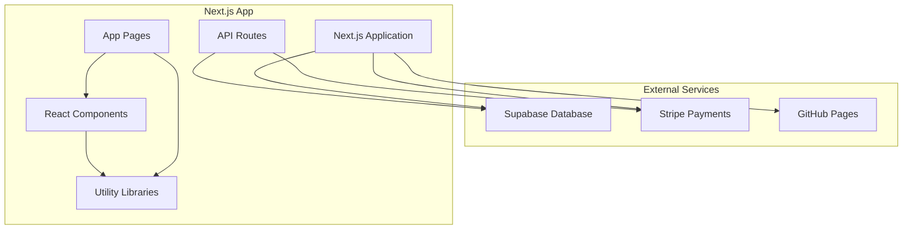
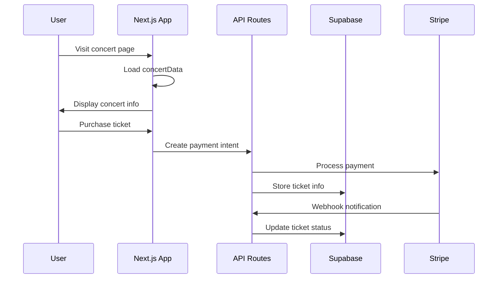

# Symphony Portal - Comprehensive Dependency Diagram

## Project Overview
**Symphony Portal** is a Next.js application for managing symphony concerts, musicians, and student interactions.

---

## 🏗️ **Architecture Overview**



---

## 📦 **External Dependencies**

### **Core Framework & Runtime**
- **Next.js 15.3.2** - React framework with SSR/SSG
- **React 19.0.0** - UI library
- **React DOM 19.0.0** - React renderer
- **TypeScript 5** - Type safety

### **UI & Styling**
- **Tailwind CSS 4** - Utility-first CSS framework
- **@tailwindcss/postcss** - PostCSS integration
- **Lucide React 0.511.0** - Icon library
- **Radix UI Components:**
  - `@radix-ui/react-dialog` - Modal dialogs
  - `@radix-ui/react-dropdown-menu` - Dropdown menus
  - `@radix-ui/react-tabs` - Tab components
  - `@radix-ui/react-toast` - Toast notifications

### **Form Handling & Validation**
- **React Hook Form 7.56.4** - Form management
- **@hookform/resolvers 5.0.1** - Form validation resolvers
- **Zod 3.25.30** - Schema validation

### **Database & Authentication**
- **@supabase/supabase-js 2.49.8** - Supabase client
- **@supabase/ssr 0.6.1** - Server-side rendering support
- **Next-Auth 4.24.11** - Authentication
- **bcryptjs 3.0.2** - Password hashing

### **Payment Processing**
- **Stripe 18.1.1** - Server-side Stripe
- **@stripe/stripe-js 7.3.0** - Client-side Stripe

### **Utilities**
- **class-variance-authority 0.7.1** - CSS class management
- **clsx 2.1.1** - Conditional class names
- **tailwind-merge 3.3.0** - Tailwind class merging
- **Express 5.1.0** - Server framework

---

## 🏠 **Internal Module Dependencies**

```mermaid
graph TB
    subgraph "App Pages"
        HOME[page.tsx - Home]
        CONCERTS[concerts/page.tsx]
        CALENDAR[calendar/page.tsx]
        ABOUT[about/page.tsx]
        FACULTY[faculty/page.tsx]
        MUSICIANS[musicians/]
        STUDENTS[students/]
        
        subgraph "Concert Pages"
            CONCERT1[RhythmOfBelonging]
            CONCERT2[piano-contest]
            CONCERT3[SongsOfTheLandAndTheSoul]
            CONCERT4[dhaka-standard]
            CONCERT5[EchoesAndElegance]
            CONCERT6[RetroRewind]
            CONCERT7[mt-vernon]
            CONCERT8[AllStarChristmasConcert]
            CONCERT9[NightAtTheMovies]
            CONCERT10[WindsOfChange]
            CONCERT11[ashley]
            CONCERT12[eldred]
            CONCERT13[HolidayAllStars]
            CONCERT14[VoicesInColor]
        end
    end
    
    subgraph "Components"
        NAV[Navigation.tsx]
        FOOTER[Footer.tsx]
        CONCERTPAGE[ConcertPage.tsx]
    end
    
    subgraph "Library Modules"
        SUPABASE_LIB[supabase.ts]
        STRIPE_LIB[stripe.ts]
        UTILS[utils.ts]
        CONCERTDATA[concertData.ts]
        CONCERTPAGEMAKER[concertPageMaker.tsx]
        NAVPATH[navigationPath.ts]
        IMAGEPATH[imagePath.ts]
    end
    
    subgraph "API Routes"
        PAYMENT_API[create-payment-intent/route.ts]
        WEBHOOK_API[webhooks/stripe/route.ts]
    end
    
    subgraph "Configuration"
        LAYOUT[layout.tsx]
        NEXTCONFIG[next.config.ts]
        GLOBALS[globals.css]
    end
    
    %% Dependencies
    HOME --> NAV
    HOME --> FOOTER
    HOME --> IMAGEPATH
    
    CONCERTS --> CONCERTDATA
    CONCERTS --> NAVPATH
    CONCERTS --> UTILS
    
    CALENDAR --> CONCERTDATA
    CALENDAR --> NAVPATH
    
    ABOUT --> IMAGEPATH
    
    MUSICIANS --> SUPABASE_LIB
    MUSICIANS --> IMAGEPATH
    
    STUDENTS --> IMAGEPATH
    
    %% Concert Pages Dependencies
    CONCERT1 --> CONCERTPAGEMAKER
    CONCERT2 --> CONCERTPAGEMAKER
    CONCERT3 --> CONCERTPAGEMAKER
    CONCERT4 --> CONCERTPAGEMAKER
    CONCERT5 --> CONCERTPAGEMAKER
    CONCERT6 --> CONCERTPAGEMAKER
    CONCERT8 --> CONCERTPAGEMAKER
    CONCERT9 --> CONCERTPAGEMAKER
    CONCERT10 --> CONCERTPAGEMAKER
    CONCERT11 --> CONCERTPAGEMAKER
    CONCERT12 --> CONCERTPAGEMAKER
    CONCERT13 --> CONCERTPAGEMAKER
    CONCERT14 --> CONCERTPAGEMAKER
    
    %% Component Dependencies
    NAV --> IMAGEPATH
    FOOTER --> IMAGEPATH
    CONCERTPAGE --> IMAGEPATH
    
    %% Library Dependencies
    CONCERTPAGEMAKER --> CONCERTPAGE
    CONCERTPAGEMAKER --> IMAGEPATH
    CONCERTPAGEMAKER --> CONCERTDATA
    
    %% API Dependencies
    PAYMENT_API --> STRIPE_LIB
    PAYMENT_API --> SUPABASE_LIB
    PAYMENT_API --> UTILS
    
    WEBHOOK_API --> STRIPE_LIB
    WEBHOOK_API --> SUPABASE_LIB
    
    %% Layout Dependencies
    LAYOUT --> NAV
    LAYOUT --> FOOTER
```



---

## 🔗 **Detailed Dependency Relationships**

### **Core Application Structure**
```
symphony-portal/
├── src/
│   ├── app/                    # Next.js App Router
│   │   ├── layout.tsx         # Root layout → Navigation, Footer
│   │   ├── page.tsx           # Home page → imagePath
│   │   ├── globals.css        # Global styles
│   │   ├── about/             # About page → imagePath
│   │   ├── calendar/          # Calendar → concertData, navigationPath
│   │   ├── concerts/          # Concerts → concertData, utils, navigationPath
│   │   │   └── [various]/     # Concert pages → concertPageMaker
│   │   ├── faculty/           # Faculty page
│   │   ├── musicians/         # Musicians → supabase, imagePath
│   │   ├── students/          # Students → imagePath
│   │   └── api/               # API routes
│   │       ├── create-payment-intent/ → stripe, supabase, utils
│   │       └── webhooks/stripe/       → stripe, supabase
│   ├── components/            # Reusable React components
│   │   ├── Navigation.tsx     # → imagePath
│   │   ├── Footer.tsx         # → imagePath
│   │   └── ConcertPage.tsx    # → imagePath
│   └── lib/                   # Utility libraries and configurations
│       ├── supabase.ts        # Database client & types
│       ├── stripe.ts          # Payment processing
│       ├── utils.ts           # General utilities
│       ├── concertData.ts     # Concert data management
│       ├── concertPageMaker.tsx → ConcertPage, imagePath, concertData
│       ├── navigationPath.ts  # Navigation utilities
│       └── imagePath.ts       # Image path utilities
```

### **External Service Integrations**

#### **Supabase Database**
- **Configuration**: `lib/supabase.ts`
- **Used by**: API routes, musician/student pages
- **Data Types**: Musician, Student, Concert, TicketPurchase
- **Operations**: CRUD operations, authentication

#### **Stripe Payments**
- **Configuration**: `lib/stripe.ts`
- **Used by**: Payment API, webhook handlers
- **Features**: Payment intents, webhooks, amount formatting
- **Integration**: Client-side and server-side components

#### **GitHub Pages Deployment**
- **Configuration**: `next.config.ts`
- **Features**: Static export, image optimization disabled
- **Build**: ESLint and TypeScript checking disabled for deployment

### **Data Flow Architecture**



### **Key Utility Dependencies**

1. **concertPageMaker.tsx**
   - Creates standardized concert pages
   - Dependencies: ConcertPage component, imagePath, concertData
   - Used by: All individual concert pages

2. **concertData.ts**
   - Central source of truth for concert information
   - Provides utility functions for filtering and routing
   - Used by: Concert pages, calendar, main concerts page

3. **imagePath.ts & navigationPath.ts**
   - Handle asset paths for GitHub Pages deployment
   - Used throughout the application for consistent routing

4. **utils.ts**
   - General utilities including CSS class management
   - Input sanitization and validation functions
   - Used by: API routes and form handling

---

## 🚀 **Build & Deployment Dependencies**

### **Development Tools**
- **ESLint 9** - Code linting
- **@eslint/eslintrc 3** - ESLint configuration
- **eslint-config-next 15.3.2** - Next.js ESLint rules

### **Build Configuration**
- **PostCSS** - CSS processing
- **postcss.config.mjs** - PostCSS configuration
- **tsconfig.json** - TypeScript configuration

### **Deployment**
- **GitHub Actions** - CI/CD pipeline
- **Static Export** - Pre-rendered static files
- **GitHub Pages** - Hosting platform

---

## 📊 **Dependency Summary**

| Category | Count | Key Dependencies |
|----------|-------|------------------|
| **External NPM Packages** | 25+ | Next.js, React, Supabase, Stripe, Tailwind |
| **Internal Library Modules** | 7 | supabase, stripe, utils, concertData, etc. |
| **React Components** | 3 | Navigation, Footer, ConcertPage |
| **App Pages** | 20+ | Home, Concerts, Calendar, Musicians, Students |
| **API Routes** | 2 | Payment Intent, Stripe Webhooks |
| **External Services** | 3 | Supabase, Stripe, GitHub Pages |

---

## 🔄 **Circular Dependencies**
**None detected** - The application maintains a clean dependency hierarchy with no circular references.

---

## 🛡️ **Security Dependencies**
- **bcryptjs** - Password hashing
- **Zod** - Input validation
- **Next-Auth** - Authentication
- **Supabase** - Secure database access
- **Stripe** - PCI-compliant payment processing

---

This diagram represents the complete dependency structure of the Symphony Portal project as of the current analysis.