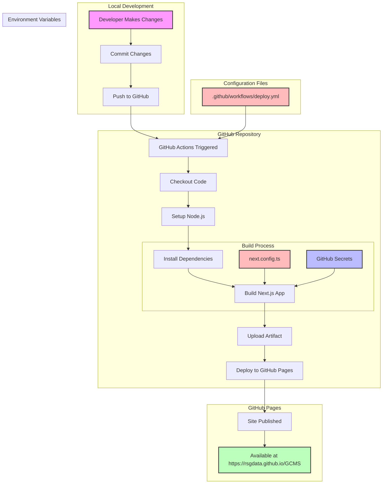
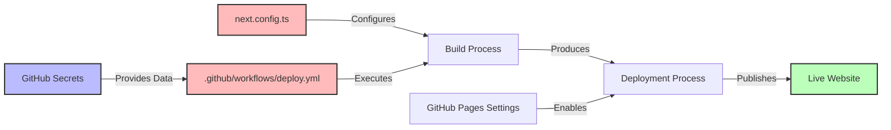
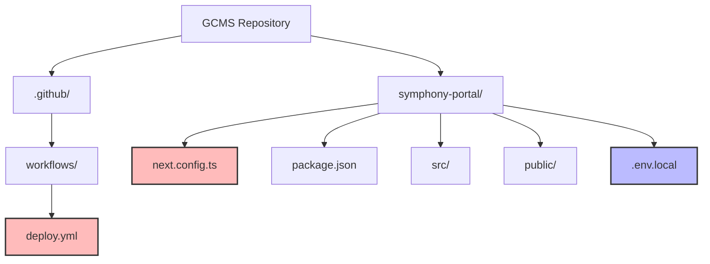
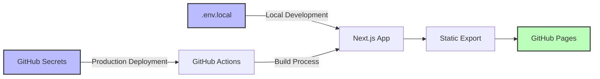

# GitHub Pages Deployment Flow Diagram

The following diagram illustrates the complete deployment flow for the Symphony Portal application to GitHub Pages.

## Deployment Process Flow

## Component Relationships

## File Structure

## Environment Variables Flow

## How to Use This Diagram

You can view this diagram in any Markdown viewer that supports Mermaid diagrams, such as:

1. GitHub (when viewing the markdown file)
2. VS Code with the Mermaid extension
3. Online Mermaid editors like [Mermaid Live Editor](https://mermaid.live/)

To make changes to the diagram:
1. Copy the code between the triple backticks
2. Paste it into a Mermaid editor
3. Make your changes
4. Export or save the updated diagram
